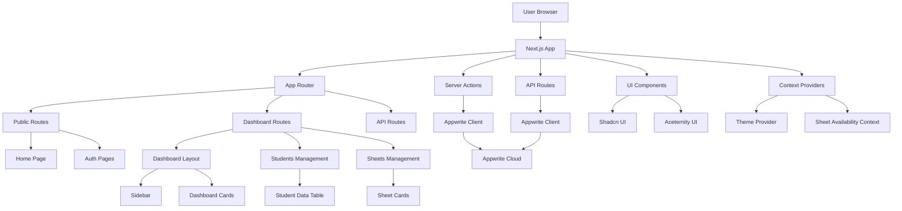

# Library Management System

A modern web application for managing library seat assignments, built with Next.js 15, TypeScript, and Appwrite.

## Table of Contents

- [Overview](#overview)
- [Key Features](#key-features)
- [Technology Stack](#technology-stack)
- [Architecture](#architecture)
- [Project Structure](#project-structure)
- [Installation](#installation)
- [Usage](#usage)
- [API Documentation](#api-documentation)
- [Component Library](#component-library)
- [Authentication](#authentication)
- [Data Management](#data-management)
- [Contributing](#contributing)
- [License](#license)

## Overview

The Library Management System is a comprehensive web application designed to streamline the management of library seat assignments. It provides administrators with tools to manage students and seat assignments while offering public users real-time visibility into seat availability.

The application features a responsive dashboard for administrators with detailed analytics and management tools, as well as a public-facing website that displays real-time seat availability information.

## Key Features

- **Student Management**: Add, edit, and view student information with assignment tracking
- **Sheet Management**: Visual representation of all 60 library sheets with status tracking
- **Real-time Availability**: Live updates on sheet occupancy (free, half-occupied, fully-occupied)
- **Authentication System**: Secure email-based OTP authentication with admin-only access
- **Dashboard Analytics**: Overview statistics and visual charts for sheet occupancy
- **Responsive Design**: Fully responsive interface that works on all device sizes
- **Data Visualization**: Interactive charts and tables for data exploration

## Technology Stack

### Frontend
- **Next.js 15** - React framework with App Router
- **TypeScript** - Type-safe JavaScript development
- **Tailwind CSS** - Utility-first CSS framework
- **Shadcn UI** - Accessible UI components
- **Aceternity UI** - Modern UI components and animations
- **React Hook Form** - Form validation and management
- **Zod** - TypeScript-first schema validation

### Backend
- **Appwrite** - Backend as a Service for authentication, database, and storage
- **Node Appwrite SDK** - Server-side integration with Appwrite

### Development Tools
- **ESLint** - Code linting
- **Prettier** - Code formatting
- **Turbopack** - Fast development server

## Architecture

### High-Level Architecture



### Frontend Architecture

The application uses Next.js App Router with route groups:
- `(dashboard)` - Protected admin routes requiring authentication
- `(user)` - Public routes for unauthenticated users

## Project Structure

```
library-web/
├── public/
│   └── assets/
│       ├── icons/
│       └── images/
├── src/
│   ├── app/
│   │   ├── (dashboard)/
│   │   │   └── dashboard/
│   │   │       ├── layout.tsx
│   │   │       ├── page.tsx
│   │   │       ├── payments/
│   │   │       │   └── page.tsx
│   │   │       ├── reservations/
│   │   │       │   └── page.tsx
│   │   │       ├── sheets/
│   │   │       │   └── page.tsx
│   │   │       └── students/
│   │   │           └── page.tsx
│   │   ├── (user)/
│   │   │   ├── layout.tsx
│   │   │   ├── page.tsx
│   │   │   ├── (auth)/
│   │   │   │   ├── layout.tsx
│   │   │   │   ├── sign-in/
│   │   │   │   │   └── page.tsx
│   │   │   │   └── sign-up/
│   │   │   │       └── page.tsx
│   │   │   └── redirect/
│   │   │       └── page.tsx
│   │   ├── api/
│   │   │   ├── dashboard/
│   │   │   │   └── sheet-stats/
│   │   │   │       └── route.ts
│   │   │   └── students/
│   │   │       ├── route.ts
│   │   │       ├── add/
│   │   │       │   └── route.ts
│   │   │       └── update/
│   │   │           └── route.ts
│   │   ├── favicon.ico
│   │   ├── globals.css
│   │   └── layout.tsx
│   ├── components/
│   │   ├── dashboard/
│   │   │   ├── DashboardCard.tsx
│   │   │   ├── Logout.tsx
│   │   │   ├── SheetCard.tsx
│   │   │   ├── SheetStatusChart.tsx
│   │   │   ├── Sidebar.tsx
│   │   │   └── student-management/
│   │   │       ├── AddStudentForm.tsx
│   │   │       ├── columns.tsx
│   │   │       ├── data.ts
│   │   │       ├── EditStudentDialog.tsx
│   │   │       └── StudentDataTable.tsx
│   │   ├── ui/
│   │   │   ├── alert-dialog.tsx
│   │   │   ├── avatar.tsx
│   │   │   ├── background-beams-with-collision.tsx
│   │   │   ├── badge.tsx
│   │   │   ├── button.tsx
│   │   │   ├── card.tsx
│   │   │   ├── dialog.tsx
│   │   │   ├── dropdown-menu.tsx
│   │   │   ├── form.tsx
│   │   │   ├── glowing-effect.tsx
│   │   │   ├── input-otp.tsx
│   │   │   ├── input.tsx
│   │   │   ├── label.tsx
│   │   │   ├── ModeToggle.tsx
│   │   │   ├── select.tsx
│   │   │   ├── sidebar.tsx
│   │   │   ├── skeleton.tsx
│   │   │   ├── sonner.tsx
│   │   │   ├── table.tsx
│   │   │   ├── textarea.tsx
│   │   │   └── theme-provider.tsx
│   │   └── user/
│   │       ├── AuthForm.tsx
│   │       ├── BackgroundBeamsWithCollisionDemo.tsx
│   │       ├── Contact.tsx
│   │       ├── ContactForm.tsx
│   │       ├── Footer.tsx
│   │       ├── HeroMotionSection.tsx
│   │       ├── HeroSection.tsx
│   │       ├── LiveSheetsAvailability.tsx
│   │       ├── Navbar.tsx
│   │       └── OTPModel.tsx
│   ├── constants/
│   │   ├── data.ts
│   │   └── index.ts
│   ├── context/
│   │   └── SheetAvailabilityContext.tsx
│   ├── lib/
│   │   ├── actions/
│   │   │   ├── sheets.actions.ts
│   │   │   ├── students.action.ts
│   │   │   └── user.actions.ts
│   │   ├── appwrite/
│   │   │   ├── appwrite.ts
│   │   │   ├── config.ts
│   │   │   └── index.ts
│   │   ├── generatedSheets.ts
│   │   └── utils.ts
│   ├── public/
│   │   ├── assets/
│   │   │   ├── icons/
│   │   │   └── images/
│   │   ├── file.svg
│   │   ├── globe.svg
│   │   ├── next.svg
│   │   ├── vercel.svg
│   │   └── window.svg
│   ├── scripts/
│   │   └── whyDidYouRender.ts
│   ├── types/
│   │   ├── a
│   │   └── index.ts
│   ├── middleware.ts
│   └── public/
├── .env.local
├── .gitignore
├── components.json
├── eslint.config.mjs
├── next-env.d.ts
├── next.config.ts
├── package.json
├── postcss.config.mjs
├── tsconfig.json
└── yarn.lock
```

## Installation

1. Clone the repository:
   ```bash
   git clone https://github.com/your-username/library-web.git
   cd library-web
   ```

2. Install dependencies:
   ```bash
   npm install
   # or
   yarn install
   # or
   pnpm install
   ```

3. Set up environment variables:
   Create a `.env.local` file in the root directory with the following variables:
   ```env
   NEXT_PUBLIC_APPWRITE_ENDPOINT=your_appwrite_endpoint
   NEXT_PUBLIC_APPWRITE_PROJECT_ID=your_appwrite_project_id
   NEXT_PUBLIC_APPWRITE_DATABASE_ID=your_appwrite_database_id
   NEXT_PUBLIC_APPWRITE_USERS_COLLECTION_ID=your_users_collection_id
   NEXT_PUBLIC_APPWRITE_SHEETS_COLLECTION_ID=your_sheets_collection_id
   NEXT_PUBLIC_APPWRITE_STUDENTS_COLLECTION_ID=your_students_collection_id
   NEXT_PUBLIC_APPWRITE_BUCKET_ID=your_appwrite_bucket_id
   NEXT_PUBLIC_APPWRITE_MAGIC_URL_REDIRECT=your_magic_url_redirect
   NEXT_PUBLIC_ADMIN_TEAM_ID=your_admin_team_id
   NEXT_APPWRITE_API_KEY=your_appwrite_api_key
   ```

4. Run the development server:
   ```bash
   npm run dev
   # or
   yarn dev
   # or
   pnpm dev
   ```

5. Open [http://localhost:3000](http://localhost:3000) in your browser to see the application.

## Usage

### For Administrators

1. Navigate to the sign-in page at `/sign-in`
2. Enter your email address to receive an OTP
3. Enter the OTP to authenticate
4. Once authenticated, you'll be redirected to the dashboard
5. Use the dashboard to:
   - View real-time sheet availability statistics
   - Manage students (add, edit, view)
   - View payment information
   - Manage reservations

### For Public Users

1. Visit the homepage at `/`
2. View real-time sheet availability without authentication
3
