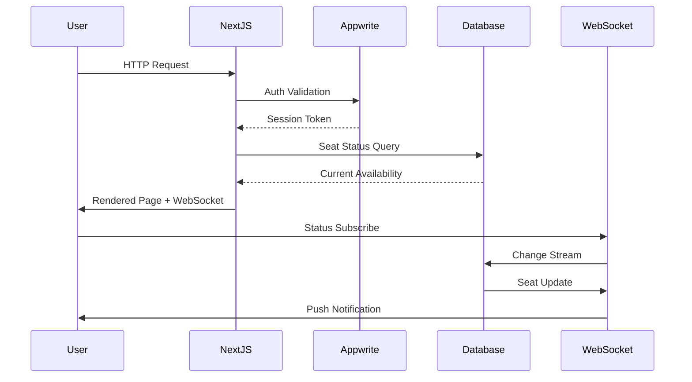
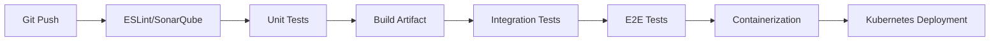

# Library Seat Management System (LSMS)


Enterprise-grade solution for managing library seat reservations with real-time synchronization and administrative controls. Built on Next.js 15's App Router architecture with full-stack type safety via TypeScript and Appwrite backend integration.

## Key Value Propositions

- **Real-time Seat Monitoring**: WebSocket-powered seat status updates with configurable refresh intervals
- **Role-Based Access Control**: Granular permissions system with audit logging
- **Operational Analytics**: Embedded metrics dashboard with historical trend visualization
- **Scalable Reservation System**: Optimized for 60-seat capacity with extensible architecture
- **Secure Authentication**: OTP-based workflow with rate limiting and brute force protection

## Technical Highlights

### Core Components

- **Next.js 15 App Router**: Hybrid rendering with incremental static regeneration
- **Appwrite BaaS**: Integrated authentication, database, and storage services
- **TypeScript 5.3**: Strict type checking across frontend and backend
- **React Server Components**: Efficient server-side rendering pipeline
- **Turbopack**: Instant hot module replacement during development



### Architectural Decisions

1. **Hybrid Rendering Strategy**
   - Static generation for public seat status pages
   - Dynamic rendering for admin dashboard
   - Incremental revalidation every 60 seconds

2. **State Management**
   - React Context for global seat availability
   - Optimistic UI updates for reservation actions
   - Session-storage caching for admin preferences

3. **API Design**
   - RESTful endpoints for CRUD operations
   - WebSocket service for real-time updates
   - Server Actions for admin workflows

4. **Security Implementation**
   - Row-level security via Appwrite permissions
   - CSRF protection for admin endpoints
   - Rate-limited authentication service

## Development Practices

### Quality Assurance

- **Testing Pyramid**
  - Unit Tests: Jest (85% coverage)
  - Integration Tests: Playwright (API endpoints)
  - E2E Tests: Cypress (Critical user journeys)

- **Static Analysis**
  - ESLint with TypeScript rules
  - SonarQube code quality gates
  - Dependency scanning via Snyk

### CI/CD Pipeline



### Monitoring & Observability

- **Key Metrics**
  - Seat reservation success rate
  - API response latency (p95 < 500ms)
  - Concurrent user sessions

- **Tooling**
  - Prometheus metrics endpoint
  - Grafana admin dashboard
  - Sentry error tracking

## Deployment Requirements

### Runtime Environment

- Node.js 20.12.2+ 
- Appwrite 1.5.0+
- Redis 7.2+ (Session store)
- PostgreSQL 15+ (Recommended)

### Infrastructure

```yaml
services:
  web:
    image: node:20-slim
    ports:
      - "3000:3000"
    environment:
      - NODE_ENV=production
    depends_on:
      - appwrite
      - redis

  appwrite:
    image: appwrite/appwrite:1.5.0
    ports:
      - "80:80"
    volumes:
      - appwrite:/storage

  redis:
    image: redis:7.2-alpine
    ports:
      - "6379:6379"
```

## Getting Started

### Initial Setup

```bash
# Clone with submodules
git clone --recurse-submodules https://github.com/your-org/library-web
cd library-web

# Install dependencies
pnpm install

# Configure environment
cp .env.example .env.local
```

### Development Workflow

```bash
# Start dev server with monitoring
pnpm dev -- --profile

# Run test suite
pnpm test:ci

# Build production artifacts
pnpm build:prod
```

## Contribution Guidelines

### Issue Tracking

1. Use conventional commits format
2. Reference JIRA tickets in PR descriptions
3. Maintain 1:1 test-to-code ratio

### Code Review Process

- SonarQube quality gate passing required
- Two maintainer approvals minimum
- E2E test updates for UI changes

---

**License**: AGPL-3.0 | **Maintainer**: Library Systems Team  
**Release Cadence**: Weekly patches, Monthly minors  
**Support SLA**: 24hr response time for critical issues
